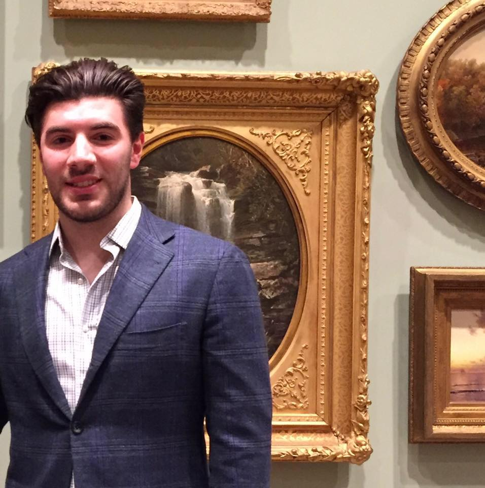

About Me

<link rel="stylesheet" href="styles.css" type="text/css">

I am a recent 2019 graduate of Cornell University with a degree in Biology. Currently I am studying for a Master’s Degree in Biostatistics and Data Science at Weill Cornell Graduate School in New York City. My resume is available [here](Matthew Mandeli Resume for CDEV.pdf).